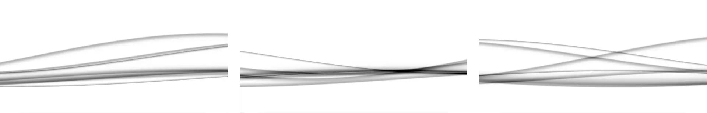

# XMB Wave Background

## 🔖 Table of contents

<details>
    <summary>
        CLICK TO ENLARGE 😇
    </summary>
    📄 <a href="#description">Description</a>
    <br>
    🎓 <a href="#objectives">Objectives</a>
    <br>
    🔨 <a href="#tech-stack">Tech stack</a>
    <br>
    📂 <a href="#files-description">Files description</a>
    <br>
    💻 <a href="#installation_and_how_to_use">Installation and how to use</a>
    <br>
    🔧 <a href="#whats-next">What's next?</a>
    <br>
    ♥️ <a href="#thanks">Thanks</a>
    <br>
    👷 <a href="#authors">Authors</a>
</details>

## 📄 <span id="description">Description</span>

This project recreates the iconic XMB wave animation from the PlayStation Portable (PSP) menu interface, entirely using HTML, CSS, JavaScript, and WebGL.
<br>
<br>
It started as a personal challenge: I had never used WebGL before, but I was determined to bring this nostalgic visual effect to life in the browser. After exploring several shaders and digging into examples and experiments shared online, I gradually crafted a clean and responsive implementation that blends seamlessly into both light and dark themes.
<br>
<br>
The wave reacts dynamically depending on the color scheme of the user’s system, creating a soft, immersive background. This project is not only a tribute to the PSP, but also a hands-on study of how fragment shaders and WebGL contexts can be embedded in a modern web page.

## 🎓 <span id="objectives">Objectives</span>

- Discover and understand the basics of WebGL.
- Learn how to write and integrate a GLSL shader in a real project.
- Build a standalone wave animation background using fragment shaders.
- Dynamically adapt visuals to system color schemes (light/dark).
- Make it easy to reuse or integrate into other personal projects.

## 🔨 <span id="tech-stack">Tech stack</span>

<p align="left">
    
    
    
    
    
    
    
    
</p>

## 📂 <span id="files-description">File description</span>

| **FILE**     | **DESCRIPTION**                                     |
| :----------: | --------------------------------------------------- |
| `assets`     | Contains the resources required for the repository. |
| `index.html` | Main HTML structure for the project.                |
| `style.css`  | Styles and animations for the project.              |
| `script.js`  | Behavior script for interactivity.                  |
| `README.md`  | The README file you are currently reading 😉.       |

## 💻 <span id="installation_and_how_to_use">Installation and how to use</span>

**Installation:**

1. Clone this repository:
    - Open your preferred Terminal.
    - Navigate to the directory where you want to clone the repository.
    - Run the following command:

```bash
git clone https://github.com/fchavonet/web-xmb_wave_background.git
```

2. Open the repository you've just cloned.

**How to use:**

1. Open the `index.html` file in your web browser.

You can also test the web application online by clicking [here](https://fchavonet.github.io/web-xmb_wave_background/). 

<p align="center">
    
</p>

## 🔧 <span id="whats-next">What's next?</span>

- Implement performance tuning (for lower-end devices).
- Create a customizable version (color, speed, wave height).

## ♥️ <span id="thanks">Thanks</span>

- Huge thanks to developers and artists who share GLSL demos and shader snippets online, especially those from [Shadertoy](https://www.shadertoy.com/). Your work was a great source of learning and inspiration.
- Shout-out to the PSP modding and retro-tech communities, this project is a little homage.

## 👷 <span id="authors">Authors</span>

**Fabien CHAVONET**
- GitHub: [@fchavonet](https://github.com/fchavonet)
